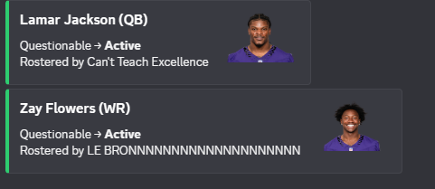

# Fantasy Football Bot

A Python bot for our ESPN fantasy football league. It pulls league data from ESPN, works out weekly stats, and posts formatted updates to Discord through webhooks.

## What it does

- **Weekly recap:** After each week, posts the top scorer, biggest blowout, closest game, worst bench decision, and the full scoreboard.
- **Injury alerts:** Compares current player statuses against the last run and posts only what changed (for example, Questionable → Active), including which team has the player rostered.



## How it works

1. `espn_client.py` connects to the league through the [`espn-api`](https://github.com/cwendt94/espn-api) library.
2. `recap.py` and `injuries.py` compute the stats and detect changes. Both are plain Python, with no external services beyond ESPN.
3. `formatting.py` and `injury_formatting.py` turn the results into Discord embeds.
4. `discord.py` sends the embeds to a webhook, batching them to stay within Discord's 10-embeds-per-message limit.

The injury tracker keeps its last-known state in `injury_state.json`. The first run only saves a baseline and posts nothing. After that, it posts only when something changed, and it saves state **after** the post succeeds, so a failed post is retried on the next run instead of being lost.

## Setup

Requires Python 3.10+.

```bash
git clone https://github.com/KoizumIsaac/Fantasy-Football-Bot.git
cd Fantasy-Football-Bot
python -m venv .venv
.venv\Scripts\activate        # macOS/Linux: source .venv/bin/activate
pip install -r requirements.txt
```

Copy `.env.example` to `.env` and fill in your values:

| Variable | Description |
|---|---|
| `ESPN_LEAGUE_ID` | Your ESPN league ID (in the league URL) |
| `ESPN_YEAR` | Season year |
| `ESPN_S2` | ESPN `espn_s2` cookie (needed for private leagues) |
| `ESPN_SWID` | ESPN `SWID` cookie (needed for private leagues) |
| `DISCORD_WEBHOOK_URL` | Webhook for weekly recaps |
| `DISCORD_INJURY_WEBHOOK_URL` | Webhook for injury alerts |

Verify the ESPN connection:

```bash
python -m scripts.test_connection
```

## Usage

Run from the repo root so the `src` imports resolve:

```bash
python -m scripts.run_recap      # post the weekly recap
python -m scripts.run_injuries   # post injury status changes
```

## Project structure

```
scripts/   entry points (run_recap, run_injuries, matchups, test_connection)
src/       ESPN client, stat logic, Discord formatting and posting
```

## Tech

Python, `espn-api`, `python-dotenv`, `requests`, Discord webhooks
